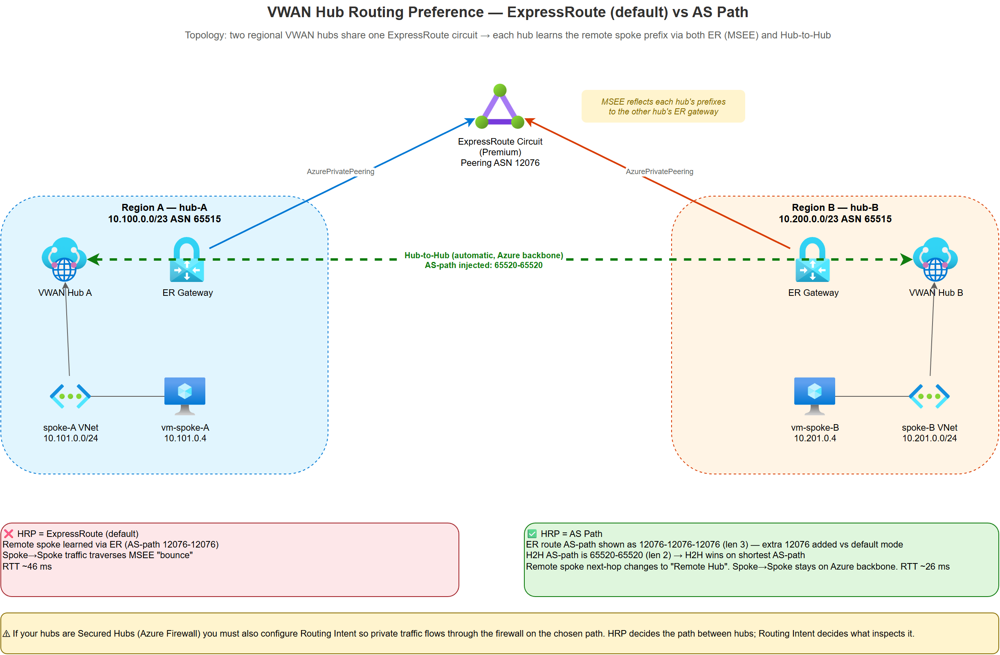

# Azure VWAN Hub Routing Preference — AS Path lab evidence

Empirical lab evidence showing how the **`hubRoutingPreference`** setting on an Azure Virtual WAN hub changes inter-hub routing from **ExpressRoute / MSEE "bounce"** to **direct Hub-to-Hub (H2H)** via the Azure backbone.



> **Scenario:** Two VWAN hubs in different Azure regions share a single ExpressRoute circuit. Each hub learns the remote hub's spoke prefix by two paths simultaneously — via its local ER gateway (MSEE reflects the route back) and via H2H. The HRP setting is the tiebreaker.

## TL;DR

| | HRP = ExpressRoute (default) | HRP = AS Path |
|---|---|---|
| Remote spoke prefix selected path | ER Gateway (MSEE "bounce") | Remote Hub (direct H2H) |
| Selected AS-path at local hub | `12076-12076` | `65520-65520` |
| Next-hop type | `ExpressRouteGateway` | `Remote Hub` |
| Spoke traceroute first hop | `169.254.1.2` (ER peering) | `10.x.x.x` (VWAN hub router) |
| Spoke-to-spoke ping RTT | **43–52 ms** | **24–28 ms** |

## Lab topology

Two VWAN hubs sharing a single Premium ExpressRoute circuit (test circuit with no on-prem advertisements, so the only prefixes on the circuit are the hubs' own).

| Resource | Address space |
|---|---|
| Hub A (`hub-a`, region A) | `10.100.0.0/23` |
| Spoke A (`spoke-a`, peered to Hub A) | `10.101.0.0/24` |
| Hub B (`hub-b`, region B) | `10.200.0.0/23` |
| Spoke B (`spoke-b`, peered to Hub B) | `10.201.0.0/24` |

Both hubs are connected to the same ExpressRoute circuit. Hub-to-Hub connectivity is enabled by default in a VWAN with multiple hubs in the same virtual WAN. One test VM per spoke.

Relevant ASNs:
- `65515` — VWAN hub router (Azure-assigned, always this value)
- `65520` — Microsoft-reserved ASN prepended to H2H advertisements (documented)
- `12076` — Microsoft MSEE ASN for ExpressRoute Azure-private peering

---

## Phase A — HRP = ExpressRoute (default)

Both hubs set to `hubRoutingPreference = ExpressRoute`.

### Hub A — effective routes (`defaultRouteTable`)

| Prefix | Next-hop type | Next hop | AS Path |
|---|---|---|---|
| `10.101.0.0/24` | Virtual Network Connection | `conn-spoke-a` | — |
| `10.200.0.0/23` | ExpressRouteGateway | `ergw-hub-a` | `12076-12076` |
| `10.201.0.0/24` | ExpressRouteGateway | `ergw-hub-a` | `12076-12076` |

Hub A reaches Hub B's spoke (`10.201.0.0/24`) via its **own** ER gateway — i.e. out through MSEE and back. The H2H path exists in the VWAN fabric but is not selected because HRP prefers ER.

### Hub B — effective routes

| Prefix | Next-hop type | Next hop | AS Path |
|---|---|---|---|
| `10.201.0.0/24` | Virtual Network Connection | `conn-spoke-b` | — |
| `10.100.0.0/23` | ExpressRouteGateway | `ergw-hub-b` | `12076-12076` |
| `10.101.0.0/24` | ExpressRouteGateway | `ergw-hub-b` | `12076-12076` |

Symmetric — Hub B reaches Hub A's spoke (`10.101.0.0/24`) via its own ER gateway.

### Spoke A (`vm-spoke-a`) → Spoke B (`10.201.0.4`)

```
PING 10.201.0.4 (10.201.0.4) 56(84) bytes of data.
64 bytes from 10.201.0.4: icmp_seq=1 ttl=62 time=45.3 ms
64 bytes from 10.201.0.4: icmp_seq=2 ttl=62 time=52.6 ms
64 bytes from 10.201.0.4: icmp_seq=3 ttl=62 time=42.4 ms
rtt min/avg/max/mdev = 42.409/46.771/52.584/4.278 ms

traceroute to 10.201.0.4, 30 hops max:
 1  169.254.1.2  32.518 ms       <-- ER Azure-side peering IP
 2  *
 3  10.201.0.4   43.317 ms
```

First hop `169.254.1.2` is the ExpressRoute peering link; traffic leaves the hub via the ER gateway toward MSEE.

### Spoke B (`vm-spoke-b`) → Spoke A (`10.101.0.4`)

```
PING 10.101.0.4 (10.101.0.4) 56(84) bytes of data.
rtt min/avg/max/mdev = 45.785/48.315/50.770/2.035 ms

traceroute to 10.101.0.4, 30 hops max:
 1  169.254.1.2  16.072 ms       <-- ER Azure-side peering IP
 2  *
 3  10.101.0.4   45.157 ms
```

Symmetric. Both directions bounce through MSEE. Higher RTT than backbone H2H would give.

---

## Phase B — HRP = AS Path

Both hubs set to `hubRoutingPreference = ASPath`. No other change.

### Hub A — effective routes

| Prefix | Next-hop type | Next hop | AS Path |
|---|---|---|---|
| `10.101.0.0/24` | Virtual Network Connection | `conn-spoke-a` | — |
| `10.200.0.0/23` | ExpressRouteGateway | `ergw-hub-a` | **`12076-12076-12076`** |
| `10.201.0.0/24` | Remote Hub | `hub-b` | **`65520-65520`** |

The remote spoke `10.201.0.0/24` has flipped from `ExpressRouteGateway` to `Remote Hub`. H2H (length 2) now beats the ER copy of the same prefix (shown at length 3, see key finding below).

Note the `/23` route (covering the remote hub's GatewaySubnet + spoke summary) is still shown via ER — H2H doesn't carry that summary, only the `/24` spoke prefix. It's unchanged reachability, just not the inter-spoke path.

### Hub B — effective routes

| Prefix | Next-hop type | Next hop | AS Path |
|---|---|---|---|
| `10.201.0.0/24` | Virtual Network Connection | `conn-spoke-b` | — |
| `10.100.0.0/23` | ExpressRouteGateway | `ergw-hub-b` | **`12076-12076-12076`** |
| `10.101.0.0/24` | Remote Hub | `hub-a` | **`65520-65520`** |

Symmetric behaviour on Hub B.

### Spoke A → Spoke B

```
PING 10.201.0.4 (10.201.0.4) 56(84) bytes of data.
rtt min/avg/max/mdev = 24.328/25.766/28.453/1.901 ms

traceroute to 10.201.0.4, 30 hops max:
 1  10.100.0.70  1.677 ms        <-- Hub A internal router IP
 2  *
 3  10.201.0.4   28.430 ms
```

First hop is now a `10.100.0.x` address inside Hub A (the hub router's internal address) — traffic stays on the Azure backbone. RTT is roughly **half** of Phase A.

### Spoke B → Spoke A

```
PING 10.101.0.4 (10.101.0.4) 56(84) bytes of data.
rtt min/avg/max/mdev = 25.336/26.278/27.423/0.863 ms

traceroute to 10.101.0.4, 30 hops max:
 1  10.200.0.69  1.677 ms        <-- Hub B internal router IP
 2  *
 3  10.101.0.4   29.989 ms
```

Symmetric. Direct H2H.

### RTT comparison

| Direction | Phase A (ER) | Phase B (ASPath) | Delta |
|---|---|---|---|
| Spoke A → Spoke B | 42–53 ms (avg 46.8) | 24–28 ms (avg 25.8) | **–21 ms** |
| Spoke B → Spoke A | 45–51 ms (avg 48.3) | 25–27 ms (avg 26.3) | **–22 ms** |

---

## Key finding

When HRP flips from `ExpressRoute` to `ASPath`, an extra `12076` is added to the AS-Path of ExpressRoute-learned routes in the hub's effective route table.

Same hub, same prefix, captured minutes apart with only HRP changed:

| HRP mode | AS-Path shown for remote prefix via ER gateway |
|---|---|
| ExpressRoute | `12076-12076` (length 2) |
| ASPath | `12076-12076-12076` (length 3) |

The ASPath-mode rule prefers shortest AS-path, so the H2H path (`65520-65520`, length 2) wins the tiebreak cleanly — the remote spoke next-hop changes from `ExpressRouteGateway` to `Remote Hub`.

You do **not** need to AS-path prepend on-premises routers to engineer the H2H preference.

---

## Routing Intent is a separate concern

HRP and Routing Intent solve different problems and are often needed together:

- **HRP** decides *which path* a hub picks when it has multiple BGP paths for the same prefix (ER vs H2H vs VPN).
- **Routing Intent** decides *what inspects* traffic between private address spaces — i.e. whether inter-hub / inter-spoke traffic is sent through the hub's Azure Firewall or NVA.

If your hubs are **Secured Hubs** (Azure Firewall or third-party NVA in the hub), flipping HRP alone will steer traffic to H2H but will **bypass** the firewall unless you also configure **Private Traffic** routing intent on each hub.

See: [About Virtual WAN routing intent and routing policies](https://learn.microsoft.com/en-us/azure/virtual-wan/how-to-routing-policies).

---

## Public Microsoft references

- [About Virtual Hub Routing Preference](https://learn.microsoft.com/en-us/azure/virtual-wan/about-virtual-hub-routing-preference) — authoritative description of the three HRP modes and their tie-break rules.
- [How to configure Virtual Hub Routing Preference](https://learn.microsoft.com/en-us/azure/virtual-wan/howto-virtual-hub-routing-preference) — PowerShell / portal / CLI steps.
- [About routing intent and routing policies](https://learn.microsoft.com/en-us/azure/virtual-wan/how-to-routing-policies) — required reading if you run Secured Hubs.
- [ExpressRoute routing requirements](https://learn.microsoft.com/en-us/azure/expressroute/expressroute-routing) — context on MSEE AS numbers (12076) and how MSEE reflects routes between circuit connections.

